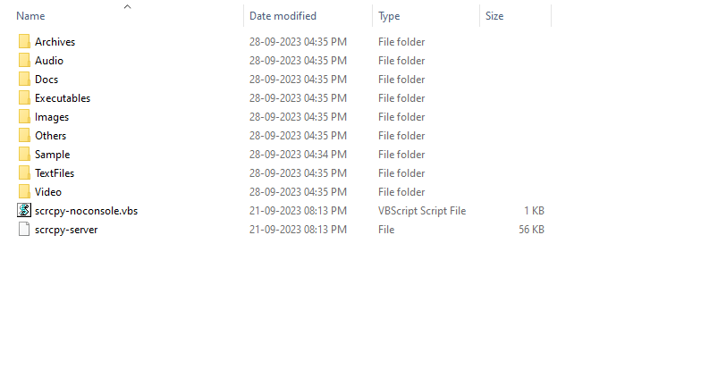

# FileArranger
This Program is written Microsoft Visual C++ to Arrange all Files of same Type in a different Folders.

# To Run This Software
You should have Microsoft Visual C++ Runtime 

You can Build from Source Code using CMAKE 

Just open CMD: 

and Run "FileArranger.exe" 

and in console, give the path of Folder, to arrange the files in it. 

<h1> Before Running this Software</h1>

<h1> AFTER Running this Software</h1>

